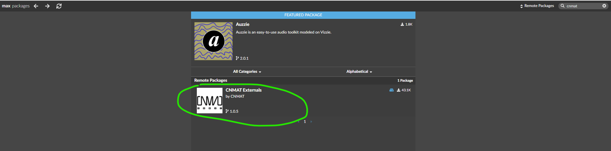
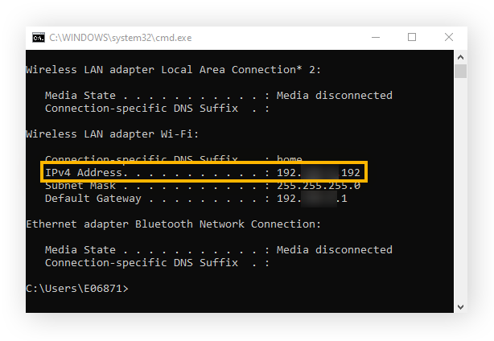
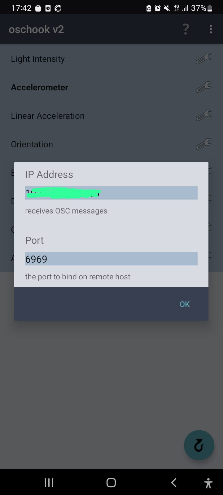
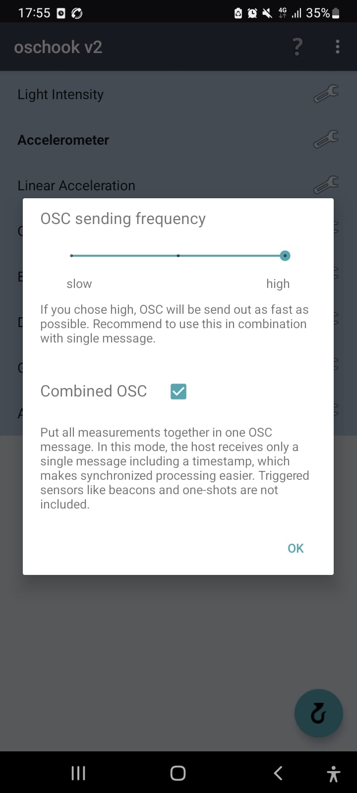
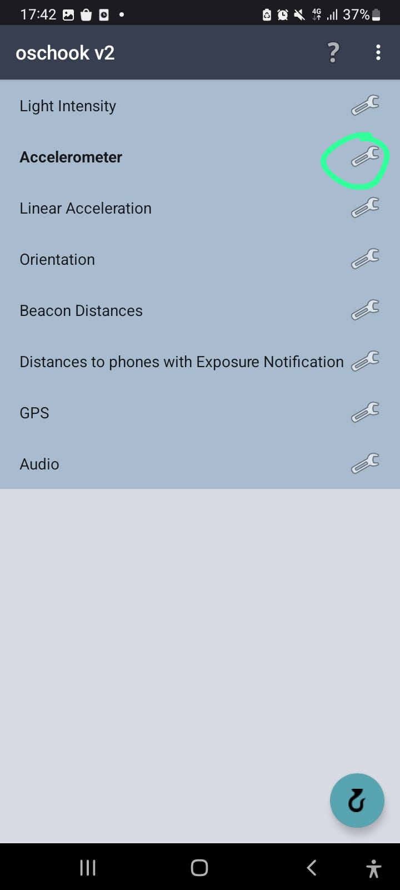
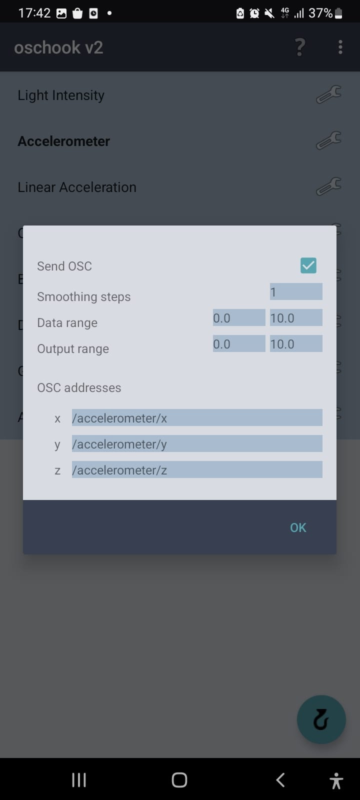
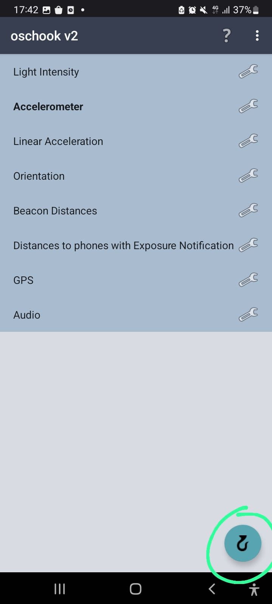

# (Airdrums with Max) 
Proiectul Airdrums with Max reprezintă un set de tobe virtual la care utilizatorul poate cânta folosind unul 
sau două telefoane, ca și cum ar fi bețe de tobă. 
Practic, utilizatorul va controla sunetele de tobe prin intermediul Wi-Fi
## (Instalare)

- Pentru instalarea Max, tutorialul de aici poate fi urmărit cu subtitrările pornite: https://www.youtube.com/watch?v=Kwgp5kSoR6c
- Pentru instalarea moduluilui OSC din Max, trebuie accesat meniul File, opțiunea „Show Package Manager”, iar 
în bara de căutare trebuie introdus textul „CNMAT”. 

Apoi, click pe CNMAT și click pe butonul „install”.
- Pentru telefoanele cu sistem de operare Android, puteți descărca gratuit aplicația oschook v2 de aici: https://oschook.soft112.com/ 

## (Utilizare)

Pentru utilizarea setului de tobe virtual, trebuiesc făcute o serie de setări. Telefoanele și calculatorul trebuie să fie conectate la aceeași rețea Wi-Fi.

- Aflarea adresei IP: https://www.avg.com/en/signal/find-ip-address
     

- Setup OSC:
    - De la meniul „...” din dreapta sus, apăsați Host/IP settings din submeniu
    - Faceți următoarele setări (în locul cenzurat, introduceți IP-ul propriu)
    
    - Din același loc, dar în submeniul Advanced settings, faceți următoarele setări:
    
    - Intrați pe accelerometru
    
    - Faceți următoarele setări
    
    - Porniți trimiterea de OSC
    

- Bătaia cu marginea telefonului de pe portul 6969 determină primul sunet (clap)
- Bătaia cu ecranul telefonului de pe portul 6969 determină al doilea sunet (snare)
- Bătaia cu marginea celui de-al doilea telefon determină al treilea sunet (kick)
- Fiecare dintre bătăi permite redarea unui sunet tare sau încet, în funcție de intensitatea loviturii.  

## (Istoric versiuni)

(30.03) Prima versiune rudimentară a constat în verificarea modulului accelerației instantanee de pe axa x, 
la un moment dat, cu un prag fix.
Problema principală a fost că o lovitură fizică determina multiple redări ale sunetului. 
Creșterea pragului a îmbunătățit foarte puțin acest aspect, dar nu suficient.

(05.04) A doua versiune a ameliorat puțin problema primei versiuni prin verificarea diferenței dintre 2 valori succesive
 pe accelerometru. 

(10.04) A treia și a patra versiune au redus semnificativ frecvența efectului nedorit rezultat din 
detecția a două bătăi în loc de una.
Blocurile TogEdge au rezolvat acest lucru, practic prin detecția de tranziții în semnalul  declanșator.
De asemenea, am adăugat graficul pentru vizualizare,

(20.04) La a cincea versiune s-a adăugat metronomul cu intervalul de 50 ms pentru a asigura unicitatea bătăilor,
 deoarece distanța temporală dintere două bătăi detectate eronat era sub 50 ms, iar omul nu poate cânta oricum mai repede.
Această versiune nu a introdus latență.

(27.04) A șasea versiune a introdus un bloc de control al intensității de 
redare a semnalului în funcție de viteza de lovire (velocity-sensitivity).
Odată cu acest bloc, a fost introdusă o latență semnificativă.

(04.05)  A șaptea versiune a vizat creșterea frecvenței de transmisie a telefonului și modificarea blocului de metronom. 
Latența s-a redus nesemnificativ, iar la eliminarea blocului cu metronom nu a apărut nicio diferență. S-a păstrat blocul cu metronom.

(05.16) Adăugat snare pe bătaia cu ecranul. Latența a crescut și mai mult.
 Am încercat eliminarea blocului de intensitate sonoră, dar latența a rămas 
 mai mare decât în cazul semnalului de accelerație pe o singură axă. 
 Am încercat opțiunea de OSC combined messages pentru o transmisiune mai rapidă în timp real, dar latența nu s-a modificat.

## (Link-uri)
Inspirație: https://www.youtube.com/watch?v=wgptHLBI0e4

# Dezvoltarea proiectului

Pentru început:

1. Creează-ți cont pe Github
2. Download și install [Github Desktop](https://desktop.github.com/)
3. Citește [acest ghid](https://charlesmartin.com.au/blog/2020/08/09/student-project-repository) și ține la îndemână [Markdown Cheat Sheet](https://www.markdownguide.org/cheat-sheet).

Apoi, procesul este următorul (inspirat de [aici](https://cs.anu.edu.au/courses/comp1720/deliverables/05-major-project/#submission-process)):

1. *fork* al acestui template către propriul tău cont de Github

_(dacă preferi cumva ca repo-ul să nu fie vizibil de către public, îl poți seta ca Private din Settings - "Change visibility". Atunci trebuie să mă adaugi drept colaborator, ca eu să am acces.)_

2. *clone* al repo-ului din Github Desktop pentru a-l downloada local

3. *commit* și *push* pe măsură ce lucrezi la proiect. Ultima versiune push-ată pe server înainte de deadline va conta pentru evaluare.

## Elemente obligatorii

1. Acest readme completat. Titlu, descriere, mod de utilizare, istoric, link-uri utile.

   Poți include și imagini și chiar [gif-uri animate](https://www.screentogif.com/), sau link-uri către materiale audio/video.
   
   Vezi [aici](https://charlesmartin.com.au/blog/2020/08/09/student-project-repository) mai multe sugestii.

2. [Declarația de originalitate](statement-of-originality.yml) completată. Tot ce nu este inclus acolo va fi considerat 100% contribuție proprie.

    *(formatul este adaptat de [aici](https://gitlab.cecs.anu.edu.au/comp1720/2018/comp1720-2018-major-project/-/blob/master/statement-of-originality.yml). Da, este un pic ironic să refolosim un doc [de altundeva](https://cs.anu.edu.au/courses/comp1720/resources/faq/#how-do-i-fill-out-my-statement-of-originality), dar menționăm sursa deci nu este plagiat!)*

3. Proiectul în sine. Tot codul trebuie să fie prezent, proiectul trebuie să poată rula conform instrucțiunilor din readme. Dacă e nevoie de asset-uri mari (sunete, video etc), [folosește Git LFS](https://git-lfs.github.com/) sau include link de download în instrucțiunile de instalare.

